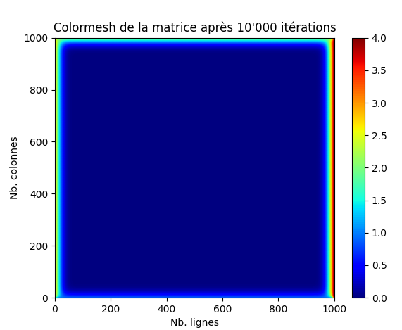
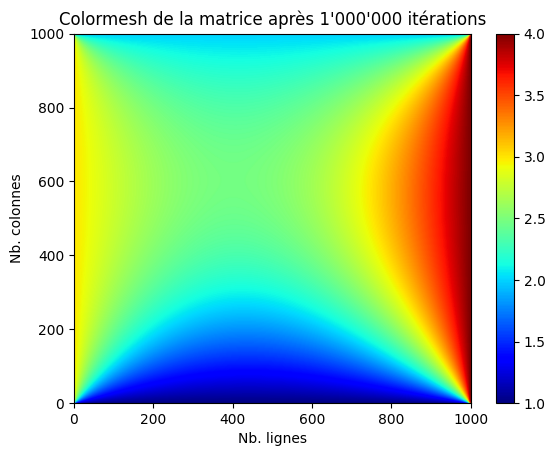

## Thomas Dagier

# Projet 2: l'équation de la chaleur


## **Introduction**

Dans le cadre du cours [Calcul Haute Perfomance](https://gitlab.unige.ch/hepia/hpc_hepia/etu_2021/), nous souhaitons réaliser une implémentation d'un code stencil qui nous permet de résoudre l'équation de la chaleur sur un domaine discret en 2 dimensions. 

Dans le TP précédent, nous avions vu comment faire du parallèlisme en utilisant la librairie [MPI](https://www.open-mpi.org/doc/current/) et les différents coeurs disponibles sur le CPU.

Cette fois-ci, nous utilisons la librairie [CUDA](https://docs.nvidia.com/cuda/) afin de résoudre l'équation de Laplace en utilisant les GPU pour un parallèlisme, en théorie, plus performant du fait que nous utilisons les threads disponibles sur le GPU.

Dans un premier temps, nous aborderons la stratégie mise en place pour résoudre ce problème en évoquant certains points-clés du code mais sans revenir sur les enjeux théoriques qui nous permettent de réaliser ce travail (voir le [TP1](https://githepia.hesge.ch/hpc_2122_projet_1/thomas.dagier-joncour/-/blob/master/rapport.md)). Ensuite, nous verrons à travers différentes mesures faites sur le cluster [Baobab](https://doc.eresearch.unige.ch/hpc/start) quelles sont les forces et limites de cette solution.

<p align="center">
    
</p>

## **Stratégie mise en place**

### **Explications générales**

Afin de représenter la plaque sur laquelle se diffuse la chaleur, nous utilisons une matrice définie en `C` par un tableau de float:
```c
float *domain;
```
De la même manière que dans le TP précédent, nous avons également des conditions de bords que nous devons inserer dans notre structure de données avant d'appliquer la convolution. Cependant, à la diférence du premier TP, nous n'avons plus besoin de couper la matrice afin de la distribuer entre les threads puisque les données sont partagées entre tous les threads sur le GPU.

En effet, nous bénéficions d'un GPU (device) qui sert de co-processeur puisqu'il est utilisé pour le calcul par le CPU (host). Le GPU possède sa RAM et execute plusieurs threads en parallèle indépendament du CPU sur un kernel.

### **La parallèlisation**

Le problème etant toujours le même, nous cherchons à parallèliser une convolution mais en ayant une approche différente. L'interêt du GPU réside dans le fait de décharger le CPU de calculs fastidieux. Le CPU a donc une place centrale dans le programme et fait appel au device (GPU) à travers une fonction `kernel` lorsque nous avons besoin de faire nos calculs. Nous utilisons donc un seul kernel.

Dans le cas de notre convolution, chaque thread du GPU aura comme objectif (au sein de la fonction `kernel` donc) de calculer le nouvel état d'un case de notre matrice. Il faudra donc:

    1- récupérer l'id du thread actuel
    2- vérifier que l'on ne modifie pas un bord de la matrice
    3- récupérer les valeurs dont nous avons besoin pour faire la convolution en un point.
    4- calculer la nouvelle valeur du point

Si notre GPU s'occupe donc de faire les calculs, il reste quand même à gèrer la boucle qui compte le nombre d'itérations. Cette partie, ainsi que l'allocation de la mémoire utile pour le GPU et la gestion des bords est faite dans une fonction `kernel_laucher`, executée par le CPU.

Nous n'avons que ces deux fonctions à implémenter afin d'utiliser cette librairie sur n'importe quel autre code.

### **Pseudo-code de la strategie mise en place**

Voici une manière de décrire l'implémentation (on pose `T` le nombre d'itération à executer):

```c

// executé par le CPU
kernel_laucher(...):
    float *matrice_initiale, *matrice_lecture, *matrice_ecriture
    // ajouter les bords à la matrice_initiale
    cudaMemcpy(matrice_lecture, matrice_initiale)
    cudaMemcpy(matrice_ecriture, matrice_initiale)

    pour i allant de 0 à T:
        // appel au GPU
        kernel(matrice_lecture, matrice_ecriture)
        cudaMemcpy(matrice_lecture, matrice_ecriture)

    retourner matrice ecriture

// executé par le GPU
kernel(matrice_lecture, matrice_ecriture):
    // determiner i et j en fonction des id du thread actuel
    matrice_ecriture[i][j] = 0.25 * (
        matrice_lecture[i-1][j] + matrice_lecture[i+1][j] + 
        matrice_lecture[i][j-1] + matrice_lecture[i][j+1] )

```

### **Spécifications**

Afin de faire le parallèlisme correctement, nous devons synchroniser les threads à la fin de chaque itérations. Ceci peut se faire avec la fonction `cudaMemcpy()` ou avec `cudaDeviceSynchronized()`. Assez logiquement, on fait en sorte d'éviter au maximum l'appel à la fonction `cudaMemcpy()` puisque c'est une opération qui prend du temps. 

Nous sommes obligés d'appeler cette fonction lors de l'allocation des données pour la matrice de lecture et d'écriture. Par contre, on n'est pas obligé de l'appeler pour copier les données de la matrice d'écriture vers lecture. On peut simplement alterner les matrice de lecture et d'écriture (voir le [code](https://githepia.hesge.ch/hpc_2122_projet_2/thomas.dagier-joncour/-/blob/master/src/laplace_solver.cu#L48) pour plus de détails). Ainsi, on ne fait que les 2 premiers appels et un dernier qui nous permettra de retourner la matrice finale. Le reste du temps, on fera simplement permuter les pointeurs entre les 2 matrices allouées avec la fonction `cudaMalloc()`.

## **Mesures de performances**

### **Mesure de temps dans le code**

Comme dans le TP précédent, le problème varie avec la taille de la matrice soient `N` (le nombre de lignes) et `M` (le nombre de colonnes). Pour essayer de tirer des conclusions plus précises, ont reproduit chaque run `5 fois` en conservant les même paramètres. Même si le nombre d'itérations n'apporte rien de très interessant, on peut quand même varier un peu la valeur de `T` (c'est jolie de voir une matrice qui se remplie).

Afin de faire varier les valeurs de `N` et `M`, nous nous basons sur 3 tailles qui dépendent de la mémoire disponible sur le GPU.
D'après la [documentation](https://doc.eresearch.unige.ch/hpc/hpc_clusters#gpus_on_yggdrasil) et les indications sur [slurm](https://doc.eresearch.unige.ch/hpc/slurm), Un choix intelligent est de prendre un GPU limité à 10 GB de memoire par coeur comme le `RTX 3080` disponible sur la machine `Baobab`.
Comme on a des matrices de float, chaque élément de nos matrice est stocké sur 32 bits. La taille de la mémoire exprimée en octets, on divise la mémoire totale par 4 pour obtenir le nombre d'éléments maximum stockable sur le GPU.  

$10 GB = 10 * 1024 * 1024 * 1024 = 10737418240$

$10737418240 / 4 = 2684354560$

Ensuite, on utilise 2 matrices, on doit donc diviser par 2 pour obtenir le nombre d'éléments sur 1 matrice:

$2684354560 / 2 = 1342177280$ 

Pour obtenir la taille de la matrice (en supposant qu'elle soit carée), On utilise la racine carée:

$\sqrt{1342177280} = 36635$

Dans notre configuration, on est donc limité à des matrices de taille `36635 * 36635`. Pour observer les variations en fonction de la taille, on fait des matrices prenant 25%, 50% et 75% de la mémoire totale soient respectivement: `9159 * 9159`, `18318 * 18318` et  `27477 * 27477`. 

Il faut aussi souligner le fait que la dimension de la grille et des blocks est importantes. Globalement, un block est composé au maximum de 1024 threads soit un matrice de `32 * 32` threads. La taille de la grille n'étant pas problèmatique, c'est elle que nous ferons varier en fonction des différentes tailles de matrices soumises. Vu nos tailles de matrices, on peut se permettre de laisser constante la taille du block et de ne faire varier que la taille de la grille (par exemple: pour une matrice `36635 * 36635`, on aurait une dimension de block de `dim3(32, 32, 1)` et une dimension de grille d'environ `dim3(36635/32, 36635/32, 1)`).

Afin de comparer les mesures de performances, nous utilisons 2 outils :
 - nvidia-smi pour mesurer l'utilisation de la mémoire
 - et la librairie `time.h` contenant la structure `clock_t` utilisée pour mesurer le temps d'execution de la convolution.

Avec un job lancé en tache de fond et l'outil nvidia-smi, on obtient différentes valeures concernant l'utilisation de la mémoire:

|    Taille     | pourcentage d'utilisation de la mémoire (sur 10GB) |
|---------------|--------|
| 9159 * 9159   | 20.1 % |
| 18318 * 18318 | 43.2 % |
| 27477 * 27477 | 67.8 % |
| 36000 * 36000 | 97.4 % |

Ensuite, dans le code, on mesure le temps pris pour executer la fonction `kernel_laucher` (ce qui correspond au  temps total mis pour faire la convolution):  

| Itérations | Taille de matrice | Temps moyen (en seconde) | Ecart-type |
|------------|-------------------|--------------------------|------------| 
|  100       |  9159 * 9159      |  0.926                   |  0.03      |
|  100       |  18318 * 18318    |  1.854                   |  0.16      |
|  100       |  27477 * 27477    |  3.518                   |  0.38      |
|  100       |  32972 * 32972    |  5.256                   |  1.1       |
|  1000      |  9159 * 9159      |  5.166                   |  0.06      |
|  1000      |  18318 * 18318    |  8.624                   |  0.17      |
|  1000      |  27477 * 27477    |  14.992                  |  0.48      |
|  1000      |  32972 * 32972    |  19.104                  |  0.12      |
|  10000     |  9159 * 9159      |  48.33                   |  0.13      |
|  10000     |  18318 * 18318    |  77.236                  |  0.27      |
|  10000     |  27477 * 27477    |  124.488                 |  0.23      |
|  10000     |  32972 * 32972    |  163.104                 |  0.58      |


Avec ces mesures, on remarque d'abord que le temps d'execution évolue de manière exponentielle et que ceci n'est pas (ou peu) dû au nombre d'itérations qui ne font que ralonger le problème. Ensuite, on remarque que l'ecrart-type est assez faible. Ceci est sans doute dû au nombre d'itérations qui est relativement faible par rapport au premier TP. D'autre part, et c'est ce que l'on pouvait penser, le temps d'execution est drastiquement différent de celui mesuré avec la librairie MPI. Ceci est aussi sans doute dû à la limitation des appels à la fonction `cudaMemcpy()` qui rajoute un temps considèrable.

## **Conclusion**

Comme on pouvait s'y attendre, pour ce type de problème, il semble bien plus efficace de travailler avec les GPU plutôt que les CPU. Après, on pourrait s'y attendre puisque les GPU sont ultra efficaces pour ce type de problèmes spécifiques (les calculs matriciels). Par contre le CPU semble plus flexible et pourrait permettre de résoudre d'autres types de problèmes plus facilement qu'avec un GPU. On peut donc dire que le GPU est parfait pour ce cas précis. Ceci est sans doute dû au nombre de thread (plusieurs milliers pour CUDA contre une dizaine à tout casser pour MPI). On observe de réelles variations dans les valeures mais ces dernières n'ont rien à voir avec les valeures mesurées avec MPI. C'est pourquoi les mesures sont un peu le seul moyen de comparer nos deux solutions. Si on avait voulu faire autrement, on aurait sans doute pû se baser sur le même nombre de thread en essayant de reproduire au plus possible des comportements similaires (le même type de materiel, la même utilisation du CPU, de la mémoire...). Ceci ne serait neanmoins pas très précis puisque les approches sont significativement différentes.
