## Thomas Dagier

# Projet 1: l'équation de la chaleur


## **Introduction**

Dans le cadre du cours de [Calcul Haute Perfomance](https://gitlab.unige.ch/hepia/hpc_hepia/etu_2021/), nous souhaitons réaliser une implémentation d'un code stencil qui nous permet de résoudre l'équation de la chaleur sur un domaine discret en 2 dimensions. 

Un exemple simple de cette application est de consièdrer une plaque rectangulaire de taille (`1000 * 1000`) sur laquelle un source de chaleur constante, appliquée aux bords haut et droits, aurait pour effet de diffuser la chaleur vers la partie froide de la plaque au fur et à mesure des iterrations.

<p align="center">
  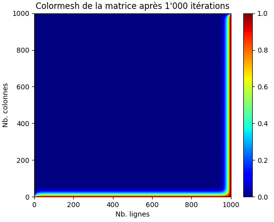  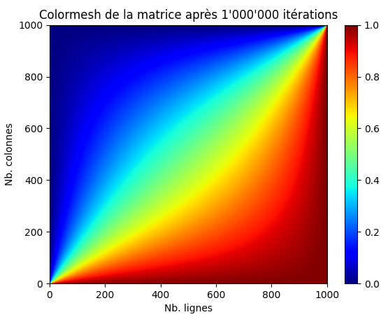
</p>

L'objectif de ce projet, à réaliser en C avec la librairie [MPI](https://www.open-mpi.org/doc/current/), est d'implémenter la solution basée sur l'équation de Laplace en parallèle de sorte à réduire le temps total d'exécution de notre problème. Ceci, de manière à réaliser des mesures de performances sur différents clusters qui nous permenttent de comprendre les limites de nos implémentations ainsi que l'environement que nous utilisons. Afin de produire cette solution, nous faisons abstractions des concepts mathématiques liés aux différents phénomènes qui démontre la validité de notre implémentation.

Dans un premier temps, nous aborderons la stratégie mise en place pour résoudre ce problème en évoquant certains points-clés du code. Ensuite, nous verrons à travers différentes mesures faites sur les clusters [Yggdrasil](https://doc.eresearch.unige.ch/hpc/start) et [Baobab](https://doc.eresearch.unige.ch/hpc/start) quelles sont les forces et limites de cette solution tout en évoquant les perspectives d'amméliorations possibles.

## **Stratégie mise en place**

### Explications générales

Afin de représenter la plaque sur laquelle se diffuse la chaleur, nous utilisons une matrice définie en C par la structure de données suivante:
```c
typedef struct matrix {
    int m, n;
    double** data;
} matrix;
```
avec `m`, le nombre de lignes, `n`, le nombre de colonnes et `data`, le tableau contenant l'ensemble des points de la matrice (`double` sur 64 bits alloués de manière contigue en mémoire).

Pour résumé grossièrement, le problème de diffusion de la chaleur reviens à appliquer une convolution `t` fois en tout point de la matrice (à l'exéption des bords).
Voici un exemple d'application avec le filtre laplacien que nous allons utiliser: 

<p align="center">
  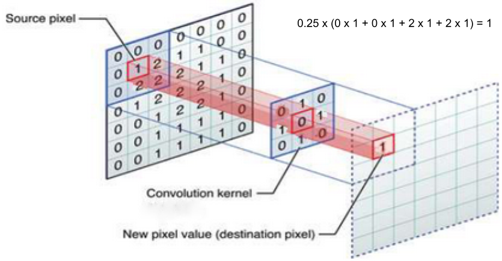
</p>


Dans cet exemple, la matrice est de petite taille. Cependant, il est possible que notre structure contienne plusieurs milliers de points. C'est pourquoi nous devons parallèliser le programme afin de réduire le temps total en séparant la charge de travail entre les différents coeurs (processeurs par abut de language). Pour une convolution 2D comme évoquée dans l'exemple, les 2 facteurs qui modifient la durée sont la taille de la matrice (`m * n`) et le nombre de fois que l'on va parcourir cette dernière pour y appliquer la convolution (`t`).

### La parallèlisation

Avec l'algorithme que nous utilisons, il semble très compliqué de parallèliser en fonction de `t`. Nous aurions besoin des valeurs précédentes de la matrice pour calculer le nouvel état et chaque processeur devrait donc attendre que le précédent ait terminé. Ceci reviendrait à faire une convolution de manière séquentielle. La solution la plus logique serait alors de séparer la matrice globale en `p` "petites matrices" (`p` désigne le nombre de processeurs qui seront utilisés pour résoudre le problème). Cette étape peut se faire avec l'appel à la fonction `Scatterv()`. Ces "petites matrices" calculeraient toutes **indépendement** la convolution `t` fois avant de rassembler les données locales dans la "grosse matrice" globale à l'aide de la fonction `Gatherv()`. 

Voici un exemple de ce que nous devons faire dans le cas où nous avons une matrice (`10 * 10`) avec (`4`) processeurs:

<p align="center">
  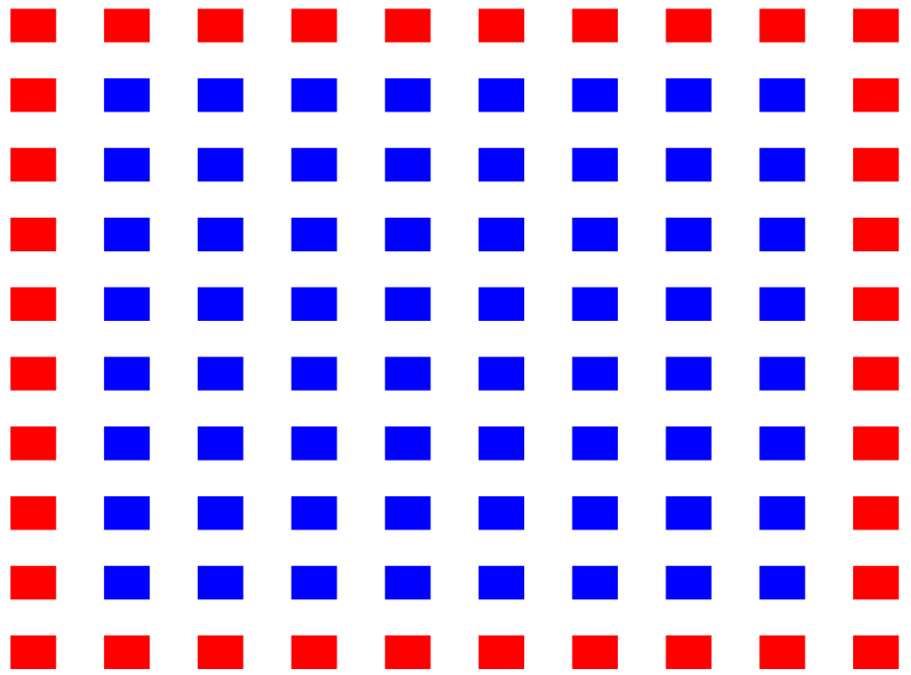  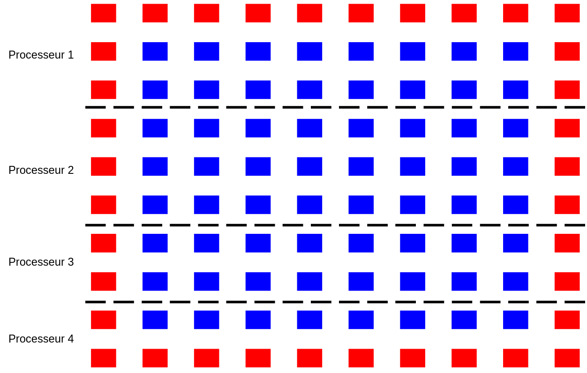
</p>

Notes: 
- les pixels rouges représentent les bords qui ne seront pas modifiés lors de la convolution à l'inverse des bleus

- le découpage aurait pu se faire en colonnes plutôt qu'en ligne. Le choix est, ici, plus intéressant en lignes car les petites matrices recevront les données de la grosse matrice qui sont exprimées en lignes au moment d'allouer les données en mémoire (dans l'attribut `data` de la structure `matrix`). Ce sera donc plus simple de transfèrer les données ainsi.

- le découpage est fait de sorte que chaque processeur ait, au plus, 1 ligne de plus que les autres afin de répartir au maximum la charge de travail globale.

Il reste cependant un problème avec cette technique: comment faire pour appliquer la convolution sur les points verts ci-dessous sachant qu'il nous manque des données ?

<p align="center">
  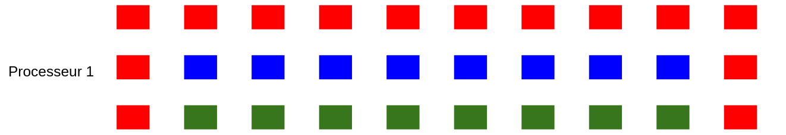  
</p>

### Le découpage des matrices intermédiaires

Une solution simple à implémenter, dont on pourrait discuter l'efficacité, est de faire en sorte que le processeur 2 envoie après chaque itération de la convolution sa ligne du haut au processeur 1 afin qu'il puisse lui aussi faire la convolution. Ceci est nottement possible car le kernel utilisé est de taille `3*3`, sinon nous aurions dû partager plus de lignes. Ainsi on pourrait représenter les communications par la figure suivante :

<p align="center">
  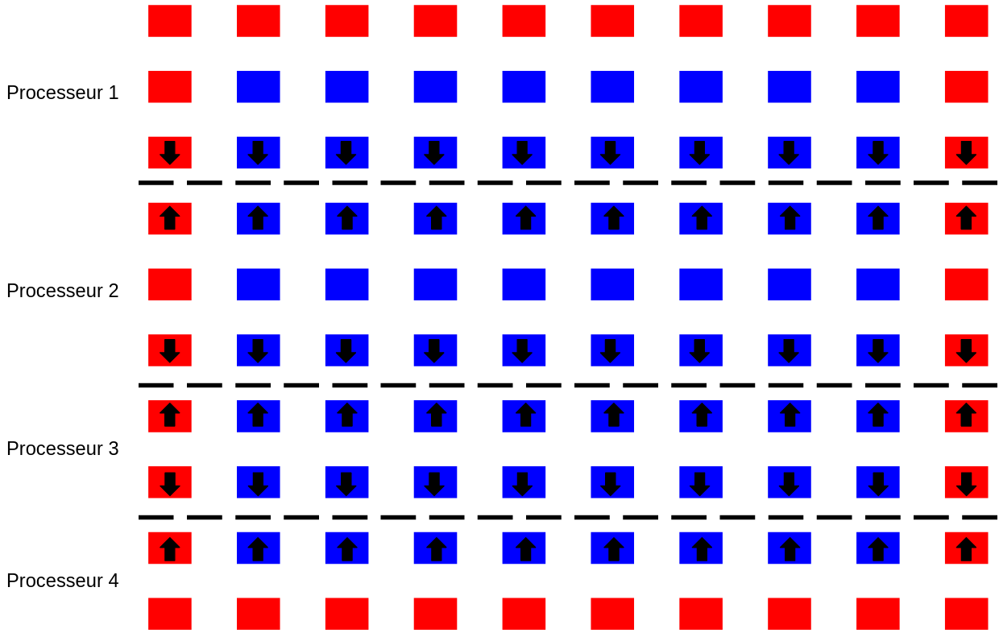
</p>


De cette manière, le processeur 1 ferait un envoie de sa dernière ligne au processeur 2 avec la fonction `MPI_Isend()` et attendrait la première ligne du processeur 2 avec la fonction `MPI_Irecv()`. Chaque processeur envoie et reçoit uniquement les lignes qui sont nécéssaires aux calculs des convolutions de chaque petites matrices. On limite donc au maximum les communications. Le choix de la fonction `MPI_Isend()` permet de commencer à receptionner la nouvelle ligne avant d'avoir terminé l'envoie de la ligne locale. Pour la fonction `MPI_Irecv`, le choix est plus discutable car on attend de toute façcon la fin de la reception avec la fonction `MPI_Wait()`.
On aurait pû utiliser la fonction `MPI_Recv()` à la place mais ça ne change pas grand chose.

### Pseudo-code de la strategie mise en place

Voici une manière de décrire l'implémentation (le code étant exécuté par chaque processeur, leurs indices uniques étant `cpu`):

```c
si cpu == 1:
  grosse_matrice = creer_matrice(m, n)
petite_matrice = creer_matrice(nouveau_m, nouveau_n)

// le processeur 1 partage les données de la grosse matrice qu'il a créé entre les petites matrices
//  de manière équitable afin que chaque processeur allège la charge de travail globale
MPI_Scatterv(1, minor_matrix, major_matrix, ...)

pour i allant de 0 a t:
  
  si cpu == 1:
    MPI_Isend(ma_derniere_ligne, 1, ...)
    MPI_Irecv(sa_premiere ligne, 2, ...)
  
  si cpu == 4:
    MPI_Isend(ma_premiere_ligne, 3, ...)
    MPI_Irecv(sa_derniere ligne, 2, ...)
  
  sinon:
    MPI_Isend(ma_premiere_ligne, cpu-1, ...)
    MPI_Irecv(sa_derniere ligne, cpu-1, ...)
    MPI_Isend(ma_derniere_ligne, cpu+1, ...)
    MPI_Irecv(sa_premiere ligne, cpu+1, ...)

  mettre_a_jour(petite_matrice, ma_nouvelle_ligne)
  petite_matrice = convolution(petite_matrice)

// les données finales sont retournées dans la grosse matrice comme si on ne l'avais jamais découpée
MPI_Gatherv(cpu, grosse_matrice, petite_matrice, ...)
```

### Adaptation du problème de découpage

Avec ce pseudo-code, on omet volontairement d'expliquer comment sont calculés `nouveau_m` et `nouveau_n`. Avec une matrice `10*10` et `4` processeurs, on supposerait que, comme dans l'exemple du dessus, p1 possède 3 lignes, p2, 3 également, p3, 2 lignes, et enfin p4, 2 lignes aussi. Cependant ce constat néglige le fait que chaque processeur a besoin d'une voir deux lignes supplémentaires pour calculer la convolution. 

On doit donc s'arranger pour que p1 ait une ligne en plus qui ne sera pas touchée mais qui permettera de faire la convolution pour la 3eme ligne. Ceci implique de devoir envoyer cette ligne à chaque itération.

Finalement, p1 possède donc 4 lignes, p2 en possède 5 (une en plus au-dessus et en-dessous), p3 en possède 4 et enfin p4 en possède 3. Simplement, ces lignes rajoutées ne seront pas retournées dans la grosses matrices puisqu'elles ne servent que pour les calculs.

Voici donc un exemple de ce que serait réelement la petite matrice du processeur p1 dans notre exemple:

<p align="center">
  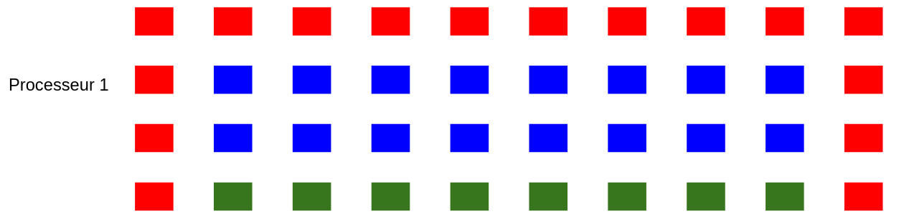
</p>

A travers cet exemple, nous avons donc vu une manière de parallèliser une convolution nous permettant de résoudre un problème de diffusion de la chaleur sur une plaque. Afin de mesurer l'efficacité de cette méthode, nous devons faire une multitude de tests en faisant varier les paramètres initiaux. Pour rappel, ces paramètres sont la taille de la matrice, le  nombre de processeurs et le nombre d'itérations. 

## **Mesures de performances**

### Mesure de temps dans le code

De manière à comparer les performances, nous devons choisir judicieusement, quand démarrer et arrêter nos mesures de temps. Avec la librairie MPI, nous utilisons la fonction `MPI_Wtime()`. Le temps est pris entre l'appel à la fonction `Scatterv()` et la fonction `Gatherv()` une fois toute la convolution éxecutée. De ce fait, on prend en compte toutes les communications inter-processeurs mais pas les I/O.

### Modèle théorique

Une bonne manière d'apréhender les mesures de performances serait de faire un modèle théorique simpliste qui nous permetterait d'imaginer les données attendues.

Afin d'obtenir ce temps pour une étape, on doit estimer le temps de communication en fonction de la quantité de données (une ligne envoyée et une ligne reçue). Toutes les mesures sont faites dans le cas où la coupe est la moins optimale (`p` ne divise pas du tout `n`). 

Pour estimer le temps de communication, on fait une rapide regression linéaire sur 50 mesures de temps pris pour faire 1 `MPI_Isend()` et 1 `MPI_Irecv()` soit 1 itération locale. On fait cette mesure pour l'envoie d'une ligne de `500`, `1000`, `5000` et `10000` éléments. 

Une fois cela obtenu, on peut trouver le temps pris en moyenne pour une itération puis le temps pris pour faire toute la convolution en parallèle. On fait le même calcul en omettant les communications dans le cas du temps séquentiel et on obtient un speedup théorique correspondant au nombre de processeurs.

<p align="center">
  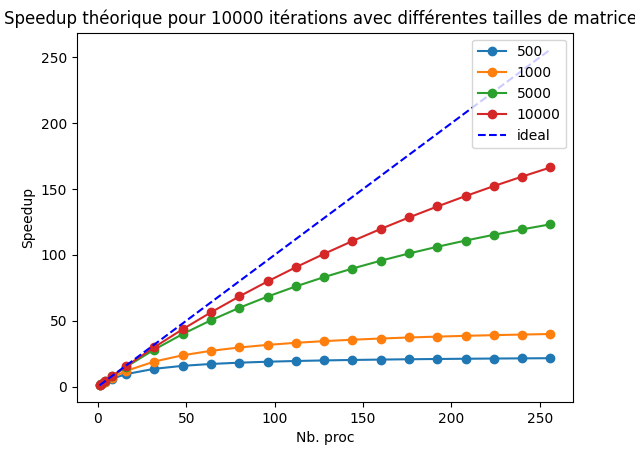
</p>

En faisant quelques tests en local, on remarque bien que les données semblent cohérentes (c'est-à-dire que le speedup évolue "à peu près logarithmiquement").

### Modèles pratiques

Maintenant qu'on est relativement confiant, on peut tester sur les clusters Yggdrasil et Baobab. Durant toute la période des tests, on se focalise sur les noeuds possèdant des processeurs [`Xeon Gold 6240 @ 2.6GHz`](https://ark.intel.com/content/www/fr/fr/ark/products/192443/intel-xeon-gold-6240-processor-24-75m-cache-2-60-ghz.html). 

Une donnée qui va varier en fonction des tests, sera le nombre de noeuds alloués pour faire les différents jobs. En effet, ce type d'architecture possède 36 coeurs et on souhaite limiter le nombre de noeuds utilisés si cela est possible. Cela signifie qu'un job nécéssitant moins de 36 coeurs peut se faire sur un noeud au maximum. Au-delà de ce nombre, on offre la possibilité d'utiliser un noeud de plus et ainsi de suite jusqu'à 256. De cette manière, on s'assure qu'un job se fasse sur un nombre de noeud constant et minimal.

Ceci-dit, il y a quand même des limites à cette techniques, il faudrait utiliser à coup sûr le même nombre de noeuds pour tous les jobs, ce qui est impossible si nous avons un job necéssitant 1 processeur puis un qui en demande 256.

Dans le modèle théorique, nous avons vu les cas correspondant aux matrices de taille:
- `500*500`,
- `1000*1000`,
- `5000*5000`,
- `10000*10000` 

pour `1000` et `10000` itérations. 

De plus nous avons testé pour des processeurs allant de 1 à 256. Précisément, `p = [1,2,4,8,16,32,48,64,80,96,112,128,144,160,176,192,208,224,240,256]`. 

On utilise ces mêmes données afin de réaliser des tests sur nos 2 clusters. Comme les environnements sont parfois variables, on execute chaque variante `k = 4` fois. 

Par exemple, on appliquera notre convolution pour `p = 1`,   `m*n = 500*500` et `t = 1000` 4 fois afin de faire une moyenne et d'étudier l'écart-type.

Plus précisément, voici le tableau correspondant à cette batterie de tests pour `k = 4` et une matrice de `10000*10000` avec `10000` iterations:

| p   | speedup baobab | moyenne baobab | ecart-type baobab | \|  | speedup yggdrasil | moyenne yggdrasil | ecrat-type yggdrasil |
| --- | -------------- | -------------- | ----------------- | --- | ----------------- | ----------------- | -------------------- |
| 1   | 1.0            | 7971.118       | 89.287            | \|  | 1.0               | 9078.55           | 95.287               |
| 2   | 1.623          | 4912.379       | 70.096            | \|  | 2.02              | 4494.267          | 67.047               |
| 4   | 2.511          | 3175.111       | 56.357            | \|  | 3.741             | 2426.536          | 49.27                |
| 8   | 5.064          | 1574.19        | 39.689            | \|  | 8.824             | 1028.868          | 32.092               |
| 16  | 8.731          | 912.924        | 30.231            | \|  | 11.395            | 796.686           | 28.244               |
| 32  | 16.806         | 474.31         | 21.802            | \|  | 28.442            | 319.194           | 17.895               |
| 48  | 25.494         | 312.664        | 17.711            | \|  | 29.905            | 303.575           | 17.452               |
| 64  | 32.174         | 247.75         | 15.772            | \|  | 43.402            | 209.173           | 14.497               |
| 80  | 38.91          | 204.861        | 14.348            | \|  | 50.92             | 178.291           | 13.39                |
| 96  | 43.97          | 181.287        | 13.501            | \|  | 55.99             | 162.147           | 12.773               |
| 112 | 52.435         | 152.02         | 12.37             | \|  | 63.293            | 143.437           | 12.018               |
| 128 | 57.16          | 139.452        | 11.851            | \|  | 71.979            | 126.127           | 11.275               |
| 144 | 60.18          | 132.455        | 11.552            | \|  | 75.088            | 120.906           | 11.041               |
| 160 | 64.021         | 124.507        | 11.203            | \|  | 79.675            | 113.945           | 10.721               |
| 176 | 68.752         | 115.941        | 10.814            | \|  | 86.953            | 104.407           | 10.267               |
| 192 | 72.325         | 110.213        | 10.546            | \|  | 91.512            | 99.206            | 10.01                |
| 208 | 76.592         | 104.073        | 10.251            | \|  | 98.891            | 91.804            | 9.634                |
| 224 | 78.25          | 101.867        | 10.142            | \|  | 99.366            | 91.365            | 9.611                |
| 240 | 81.551         | 97.744         | 9.937             | \|  | 104.777           | 86.646            | 9.362                |
| 256 | 84.398         | 94.447         | 9.77              | \|  | 108.912           | 83.357            | 9.185                |

Avec ce tableau, on observe dans un premier temps, que la moyenne du temps d'exécution évolue "à peu près" comme on veut sur les 2 clusters. Ceci a, biensûr, un impact sur le speedup qui augmente. L'importance de ce tableau réside surtout dans l'écart-type. On observe que ce dernier diminue logiquement à mesure que le temps d'exécution dimiue. On peut donc supposer que les mesures sont "cohérentes". Cependant, on remarque déjà qu'il y a une grosse différence de speedup entre l'exécution sur Baobab (à gauche) et Yggdrasil (à droite).

Afin de mieux voir ces données, on réalise un graphique de l'évolution du speedup en fonction du nombre de processeurs. Ceci nous permet aussi de visualiser les données pour différentes tailles de matrices:

- sur Baobab:

<p align="center">
  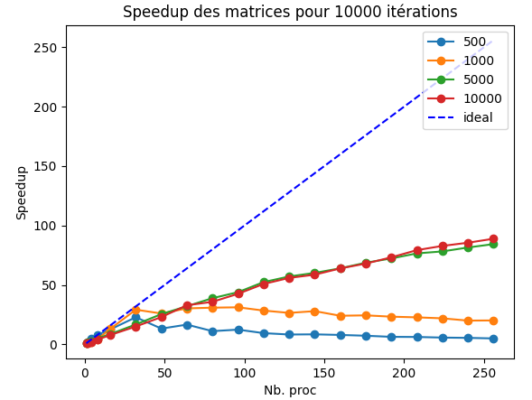
</p>

- sur Yggdrasil:

<p align="center">
  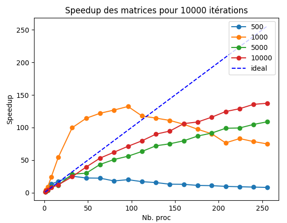
</p>

En dehors de la matrice `1000*1000` qui a pris un coup de chaud sur Yggdrasil, on observe bien sur ces 2 graphiques que les tendances des courbes sont similaires aux données théoriques estimées grossièrement. Même si les valeurs des speedup n'ont rien à voir avec la théorie, quaisment tous les speedups sont relativement similaires entre Baobab et Yggdrasil et suivent la tendance de la théorie.

On pourrait expliquer cette différence significative sur Yggdrasil pour la matrice `1000*1000` par la mise en cache des données qui accélère la lecture afin de minimiser les accès à la ram et au disque.

On peut également voir le résultat avec les mêmes matrices, cette fois pour 1000 itérations:

- sur Baobab:

<p align="center">
  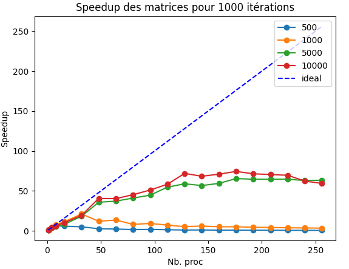
</p>

- sur Yggdrasil:

<p align="center">
  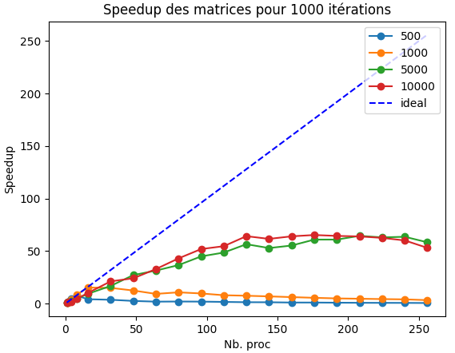
</p>

Ce qui est interessant à remarquer sur cette seconde version c'est que le nombre d'itération ne change pas la manière dont évolue le speedup mais plutôt le temps en lui-même et également que le cas étrange de la matrice `1000*1000` est un cas isolé. On peut donc admettre sans trop de doute que modifier le nombre d'itération ne fait qu'augmenter le temps d'exécution sans modifier le problème.

Ceci se vérifie avec les heatmap des 2 cas où l'on fait 10000 itérations:

- sur Baobab:

<p align="center">
  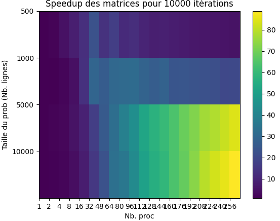
</p>

- sur Yggdrasil:

<p align="center">
  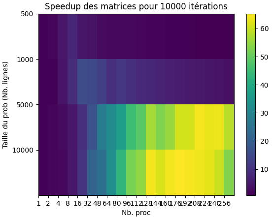
</p>


On voit que la range où le speedup est le meilleur reste la même que l'on fasse les tests pour `1000` ou `10000` itérations ce qui confirme bien l'hypothèse faite juste avant.

### Comparaison entre les 2 clusters

Mis à part la courbe des `1000*1000` qui est asthmathique on observe que les courbes sont quasiment les mêmes entre les 2 clusters. En tout cas on peut suposer qu'elles tendent vers la même valeur tout en observant que c'est surtout lors des petits nombre de processeurs que les différences sont visibles. 


### Limites de l'implémentation (Modèle théorique vs Modèle pratique)

Normalement on utilise l'implémentation séquentielle la plus performante. Ici, on suppose que c'est juste le temps mis pour 1 processeur sans la moindre communication. C'est une des raisons pour lesquelles le speedup est, en pratique beaucoup plus faible.

D'autre part il est possible que les résultats des tests dépendent grandement des conditions des clusters à un instant `T`. Pour les mêmes données initiales, il est arrivé d'obtenir 2 courbes de speedup assez différentes. Les résultats peuvent donc grandement dépendre des machines et des outils utilisés.

Voici un exemple fait sur Baobab dans les mêmes conditions où les valeurs (nottement la courbe des `1000*1000`) ne sont pas les mêmes:

<p align="center">
  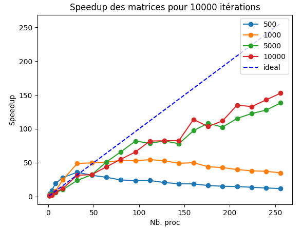
</p>

Une bonne idée aurait été de choisir une valeur de `k` plus grande afin de maximiser les chances d'avoir des valeurs cohérentes.

Enfin, et ce n'est pas négligeable, le modèle théorique est assez peu précis même s'il décrit le bon comportement. Il est possible que l'on s'attende à avoir des valeurs qui sont sur-éstimées.

### Perspective d'amméliorations

Le code semble assez bien optimisé au vu des courbes obtenues. Il aurait été cependant judicieux de modifier un peu la manière de faire chaque itérations.
En effet, on aurait pù laiser les nœuds impairs envoyer leurs rangées supérieures et inférieures tandis que les nœuds pairs adjacents reçoivent (et stockent ces informations dans les rangées suplémentaires). On aurait pu inverser ensuite, ce qui aurait pû, peut-être, éviter de faire des `MPI_Wait()`. 

Une autre techniques intéressante aurait été de faire en sorte que les petites matrices calculent ce qu'elle peuvent calcuer sans les rangées suplémentaires puis faire cette dernière étape une fois la reception terminée.

## Conclusion

En conclusion, on pourrait dire que le parallèlisme est efficace bien que limité pour tout un tas de raisons évoquées. Cela reste une excellente solution afin de gagner du temps sur des calculs qui demandent un temps considérable d'exécution. 

Concernant, le projet en lui-même, c'etait un travail interessant à faire. Le code n'a pas demandé beaucoup de temps. En revanche je me suis retrouvé un peu perdu au moment de devoir faire le rapport. En effet, à moins de lire toute la doc, ce n'est pas très simple de comprendre ce qui ne marche pas ou ce que l'on fait mal (ex: `--nodes=min-max` est un paramètre super important à utiliser sinon les valeurs des speedups varient beaucoup plus entre les différentes batteries de tests qui prennent en compte les mêmes données initiales).

En outre, 1 semaine a semblée assez court pour bien réaliser nos tâches sur les clusters étant donné que nous apprenions au fur et à mesure de nos erreures (parfois bêtes). 

Pour terminé, ce travail aura quand même permis de bien comprendre l'interêt de bien parallèliser et de passer du temps avant de coder sur ce qui pourrait être la "meilleure manière" d'implémenter le code (ce qui joue énormément pour les mesures de performances).
